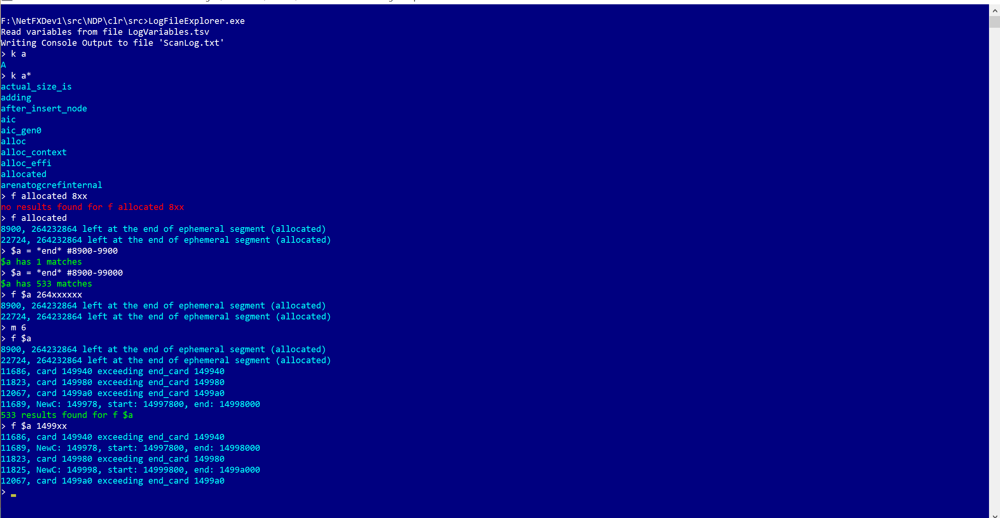

# LogFileExplorer
Reads and creates an inverted index of a log file, or any file containing ascii lines of text that can each be considered items.
Has a command line type UI, where complex expressions can be used to find items in the log file.
Useful for interpreting log files too big to fit in editors, and too complex to use file search.

To Run:

LogFileExplorere.exe <filepath>

Examples of commands:

 Command       | Explanation                                                                  
---------------|------------------------------------------------------------------------------
F  3F429        |  Finds the number 3F429                                                      
F  3F42x        |  Finds numbers in the range of 3F420-3F42F                                   
F  30-3F        |  Finds numbers in the range 30-3F                                            
F  clear_memory |  Finds the text 'clear memory' (case insensitive) within log entries         
F  ab*          |  Finds text beginning with 'ab'                                              
F  \*a\*          |  Finds text containing 'a'                                                   
F  3 4X ka t*   |  Finds log entries with all four conditions met                              
F  (3 \| 4) & k  |  Finds logical match                                                         
F  #200-300     |  Shows log entries 200 to 300                                                
$a = ab* \| cd* |  Creates a variable with the match                                           
F  $a 3F4ax     |  Finds entries matching both $a variable and number 3F4aX                    
K  a*           |  Lists all keys beginning with the string 'a'                                
K  \*dog\*        |  Lists all keys containing dog                                               
K  52F00-55000  |  Shows each unique number found in the logs within the specified range.     
K  52xxx        |  Shows each unique number found in the logs within the specified range.     
M  50           |  Show at most 50 items.                                                      
V  $a           |  Shows all variables starting with $a                                        
V               |  Shows all variables                                                         

---

